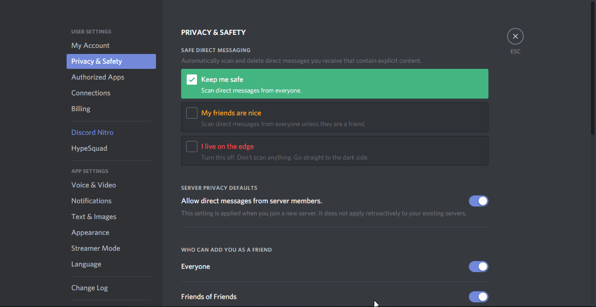
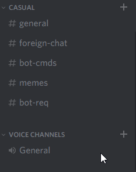

#### Stats-bot 

*Your Discord server stats bot.*

# How to get channel ID-s?

*Enable Developer mode and follow steps below*

*When the Developer mode is enabled, simply right click the channel, click `Copy ID` and the ID will be saved to your clipboard.*

